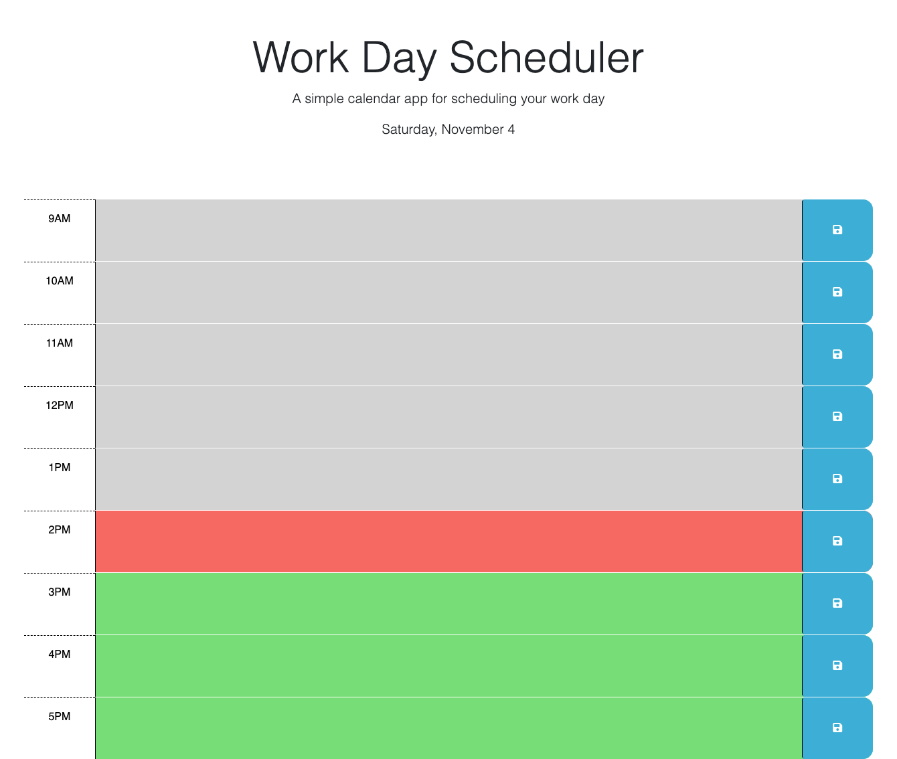

# Work Day Scheduler

## Description

As an employee with a busy schedule, you often need a simple and effective way to manage your time. The Work Day Scheduler is a web application that allows you to add and organize important events in a daily schedule. It helps you plan your day effectively by providing the following features:

- Displays the current day at the top of the calendar.
- Presents time blocks for standard business hours from 9 am to 5 pm.
- Color-codes time blocks to indicate whether they are in the past, present, or future.
- Allows you to enter and save events for each time block.
- Persists saved events in local storage, ensuring they are available even after page refresh.

## Usage

To use the Work Day Scheduler you can open the application in your web browser from the following url: https://gtorresv.github.io/legend/. The current day will be displayed at the top of the calendar, and you'll see time blocks for standard business hours (9 am to 5 pm) as you scroll down the page. Each time block will be color-coded to indicate its temporal status: past, present, or future. Past is going to be displayed in gray, present will be red and future is green. You can click on a time block to enter an event for that specific hour. After entering your event, click the save button associated with that time block to save it to local storage. Even if you refresh the page or return to it later, your saved events will persist and be visible in their respective time blocks. The following screenshots are a sample of the web application:

Work Day Scheduler:

An example of how an event is saved to local storage:

## Credits

I recieved assistance from the coding bootcamp tutor Abdullah Al Hilfi.

## License

To view more details from the MIT License you can refer to it on the repository.
